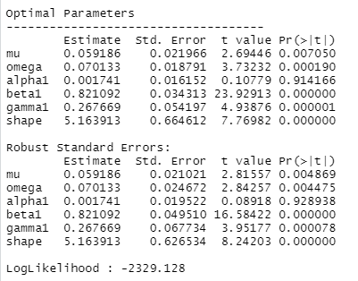
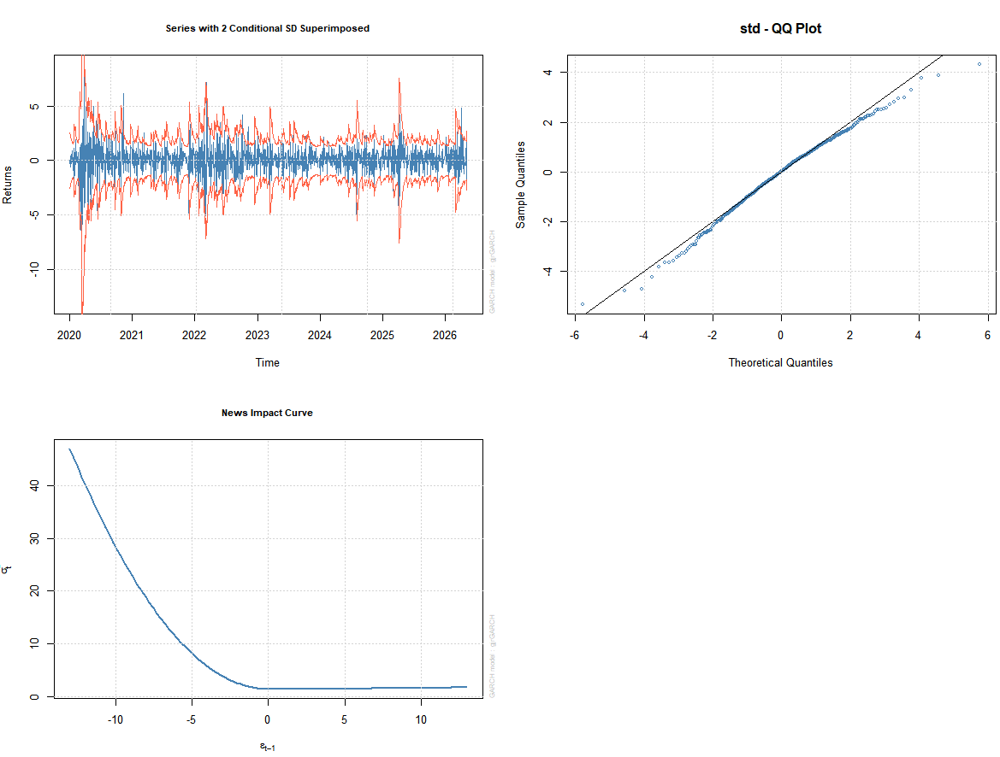
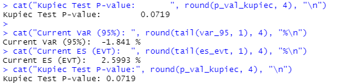

### Financial-Risk-Modelling-Project

**Objective**: Identify systemic risks through advanced volatility and tail risk modelling.

**Methods**: GJR-GARCH, Extreme Value Theory (EVT), VaR/Expected Shortfall.

**Validation**: Statistical backtesting of risk models.

### 1- Euro Stoxx 50 Risk Analysis (2020 - 2026):
- This project calculates the daily financial risk of the **Euro Stoxx 50 index**. Using statistical models, we estimate how much an investor could lose during extreme market events. We go beyond simple averages by using Extreme Value Theory (EVT) to capture severe market crashes.

- **Libraries** Used :

   **quantmod**: for downloading real time financial data from Yahoo Finance.

   **rugarch**: for modelling market (volatility).

   **extRemes**: for calculating the risk of extreme events

- We analyze the daily log-returns of the Euro Stoxx 50 from January 2020 to May 2026. This period includes major stress events like the COVID-19 pandemic.

### 2- Financial markets have two specific behaviors:

  **Volatility**: High risk periods tend to stick together. If the market is shaky today, it will likely be shaky tomorrow.

  **The Leverage Effect**: Markets react more to bad news than to good news. Our model (GJR-GARCH) is specifically designed to catch this asymmetry.

### 3- EVT : 

- We use Extreme Value Theory to focus specifically on the "tail" of the distribution, to ensure our risk estimates are realistic.

### 4- Backtesting (verification) : 

- We use the Kupiec Test to check if our model was right. If the actual market losses exceed our predictions more than 5% of the time, the model is rejected.

### 5- Key Statistical Findings : 

**Leverage Effect (gamma1)**: Our results show a positive and significant value. 

- **Interpretation**: Negative shocks have a much stronger impact on future volatility than positive ones.

**Fat Tails (shape)**: The high value confirms that the Euro Stoxx 50 has Fat Tails.

- **Interpretation**: Financial returns do not perfectly follow a normal distribution. Therefore, models incorporating fat tails provide a better estimation of extreme market risks.

### Conclusion : By combining GARCH and EVT, this project provides a framework for market risk management.

## Results & Interpretation

### 1. Model Calibration (GARCH Process)
Here is the statistical output of our model's parameters:

* **Leverage Effect (gamma1):** Our value is significant (p < 0.05), proving that the Euro Stoxx 50 reacts more strongly to negative shocks.
* **Fat Tails (shape):** The parameter confirms that returns are not normal, justifying the use of Student-t.

### 2. Visual Analysis
These plots show how the model captures the market reality:

* **Volatility Envelope:** When the market is calm, the lines are close together. When there is a crisis (like in 2020), the lines jump apart because the risk is higher.
* **News Impact Curve:** The asymmetry shows that a price drop creates much more volatility than a price increase of the same size.

### 3. Final Risk Metrics (Latest Values)
These are the core results obtained via the `cat()` and `tail()` functions:

| Metric | Interpretation | Value |
| :--- | :--- | :--- |
| **VaR (95%)** | Maximum expected loss 95% of the time | **-1.841 %** |
| **Expected Shortfall (EVT)** | The average loss expected during a real market crash | **2.5993 %** |
| **Kupiec Test (p-value)** | Model reliable | **0.0719** |

**Interpretation:** Our Kupiec Test score is **0.0719**. Since this is above 0.05, the model is officially **reliable**. It means our risk predictions match the real market behavior perfectly.
